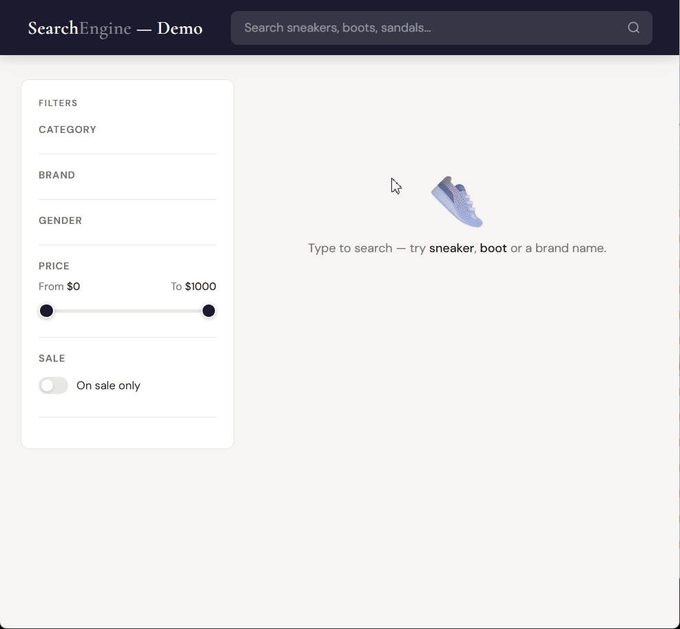

# php-fts

A self-contained full-text search engine written in pure PHP.  
No extensions. No external services. No dependencies. Just files.

---

## Who is this for?

php-fts is designed for projects where deploying a dedicated search service is not an option — shared hosting, small VPS, or simply situations where you want to keep your stack minimal and portable.

If you have access to Elasticsearch, Meilisearch or Typesense and the infrastructure to run them, use those. They are more powerful and built for high-traffic, large-scale workloads.

If you don't — or if you'd rather not — php-fts gives you solid full-text search with ranked results, filters, and tolerant matching, with nothing to install and nothing to configure beyond a directory path.

**It is a good fit if:**
- You are on shared hosting (OVH, Infomaniak, o2switch, etc.)
- You want zero infrastructure overhead
- Your dataset is in the range of hundreds to tens of thousands of documents
- You index offline or on a schedule, and serve searches at runtime

**It is not a good fit if:**
- You need real-time indexing under heavy concurrent write load
- Your dataset is in the millions of documents
- You need geo search or multi-tenant isolation

---

## Features

- **Full-text search** with trigram indexing — tolerant to typos and partial matches
- **BM25 + IDF scoring** — industry-standard relevance ranking (same algorithm as Lucene / Elasticsearch)
- **Per-document score** — exposed in results, usable to build facet counts, sorting, or custom ranking
- **Field boosting** — weight some fields (e.g. title) more than others
- **Filters** — exact match, comparisons, range, `in`, `not in`, `contains` on array fields
- **Combined AND / OR filtering** — flexible condition logic
- **Bulk insertion** — up to 12× faster than individual inserts, single lock for the whole batch, crash-safe
- **Soft delete** with tombstones — fast deletes, cleaned up on compaction
- **Atomic update** — soft delete + re-insert in a single lock
- **Compaction** — rebuilds index files cleanly, removes deleted documents and fragmentation
- **Fragmentation monitoring** — know when to compact
- **Binary file storage** — portable across servers, no rebuild needed
- **O(1) trigram lookup** — fixed-size index (~810 KB), no tree traversal
- **No extensions required** — runs on any standard PHP 8.1+ installation

---

## Requirements

- PHP **8.1** or higher
- Read/write access to a directory for index files

---

## Installation

**Via Composer**

```bash
composer require ols/php-fts
```

**Manual install** — if you are not using Composer, copy the `src/` directory into your project and include the autoloader:

```php
require '/path/to/php-fts/src/autoload.php';
```

---

## Quick start

```php
use Ols\PhpFts\SearchEngine;

$engine = new SearchEngine();
$engine->open('./search_data');

// Insert a document
$docId = $engine->insert([
    'title'       => 'Brown leather shoe',
    'description' => 'Elegant city shoe in soft leather',
    'price'       => 129.90,
    'stock'       => 42,
    'active'      => true,
    'category'    => 'Shoes',
    'brand'       => 'Adidas',
    'tags'        => ['summer', 'luxury', 'city'],
]);

// Search
$results = $engine->search('leather shoe', limit: 20, boosts: [
    'title'       => 3.0,
    'description' => 1.0,
]);

foreach ($results as $result) {
    echo $result['document']['title'] . ' — score: ' . $result['score'] . PHP_EOL;
}

$engine->close();
```

---

## API Reference

### Open / Close

```php
$engine->open('./search_data');   // Creates directory and files if they don't exist
$engine->close();                 // Flushes and closes all file handles
```

### Insert

```php
// Single document — returns the doc ID (binary offset, keep it if you need update/delete)
$docId = $engine->insert([
    'title'  => 'My product',
    'price'  => 49.90,
    'active' => true,
    'tags'   => ['new', 'sale'],
]);

// Bulk insert — one lock for the entire batch, significantly faster
$docIds = $engine->insertBulk([
    ['title' => 'Product A', 'price' => 29.90],
    ['title' => 'Product B', 'price' => 59.90],
]);
```

Supported field types: `string`, `int`, `float`, `bool`, `array` of strings.

### Search

```php
$results = $engine->search(
    query:         'leather shoe',
    limit:         20,
    maxCandidates: 5000,
    boosts:        ['title' => 3.0, 'description' => 1.0],
    filters:       [...],
);
```

Each result:

```php
[
    'docId'    => 942222,   // document identifier
    'score'    => 43.74,    // BM25+IDF relevance score, 0-100
    'document' => [...],    // original document array
]
```

The `score` field is available on every result and can be used to build facet counts, custom sorting, or relevance thresholds.

### Filters

```php
$results = $engine->search('shoe', filters: [

    'and' => [
        ['field' => 'active',   'op' => '=',        'value' => true],
        ['field' => 'stock',    'op' => '>',         'value' => 0],
        ['field' => 'price',    'op' => '<=',        'value' => 300],
        ['field' => 'category', 'op' => 'in',        'value' => ['Shoes', 'Sport']],
        ['field' => 'tags',     'op' => 'contains',  'value' => 'luxury'],
    ],

    'or' => [
        ['field' => 'brand', 'op' => '=', 'value' => 'Adidas'],
        ['field' => 'brand', 'op' => '=', 'value' => 'Puma'],
    ],

]);
```

Both `and` and `or` are optional, but at least one must be present.  
When both are used: all AND conditions must pass **and** at least one OR condition must pass.  
A document missing a filtered field is excluded from results.

| Operator                  | Supported types          |
|---------------------------|--------------------------|
| `=` `!=`                  | int, float, bool, string |
| `>` `>=` `<` `<=`         | int, float               |
| `in` `not in`             | int, float, string       |
| `contains` `not contains` | array (document field)   |

### Update / Delete

```php
// Atomic update: soft delete + re-insert in a single lock
$newDocId = $engine->update($docId, ['title' => 'Updated title', 'price' => 149.90]);

// Soft delete (cleaned up on compaction)
$engine->delete($docId);
```

### Maintenance

```php
$count = $engine->count();               // Number of live documents
$rate  = $engine->fragmentationRate();   // Fragmentation percentage (0 = clean, 100 = all deleted)

if ($engine->fragmentationRate() > 20) {
    $engine->compact();                  // Rebuild index files, remove deleted documents
}

$engine->reset();                        // Wipe all index files and start fresh
```

---

## Index files

```
search_data/
  documents.bin    — serialized documents (JSON, binary format)
  trigrams.bin     — fixed-size trigram index ~810 KB (37^3 entries, O(1) access)
  postings.bin     — doc_id lists per trigram
  tombstones.bin   — deleted doc_ids (cleared on compaction)
```

Files are fully portable — copy them between servers without rebuilding.

---

## Scoring

Relevance is computed using **BM25 + IDF**:

- **BM25** — term frequency saturation (a word appearing 10x doesn't score 10x higher) and document length normalization. Parameters: k1 = 1.5, b = 0.75 (standard Lucene defaults).
- **IDF** — a trigram present in every document contributes little; a rare trigram contributes a lot.
- The final score is normalized between 0 and 100.

---

## Benchmark

Benchmarks were run on two environments:

- **Windows 11** — local machine, NVMe SSD, PHP 8.3
- **Linux (OVH shared hosting)** — standard shared plan, PHP 8.3

### Insertion

| Volume  | insert() Win | insert() Linux | insertBulk() Win | insertBulk() Linux | Gain Win | Gain Linux |
|---------|-------------|----------------|------------------|--------------------|----------|------------|
| 1 000   | 3.23 s      | 8.58 s         | 274 ms           | 167 ms             | 11.8×    | 51.3×      |
| 5 000   | 17.43 s     | 38.94 s        | 1.35 s           | 952 ms             | 12.9×    | 40.9×      |
| 10 000  | 35.72 s     | 66.15 s        | 2.97 s           | 1.62 s             | 12×      | 40.8×      |
| 20 000  | 72.87 s     | 129.09 s       | 5.78 s           | 3.44 s             | 12.6×    | 37.5×      |

> Always prefer `insertBulk()` over `insert()` in production: it acquires a single lock
> for the entire batch and is consistently faster — up to **12×** on local NVMe,
> up to **51×** on shared Linux hosting. Both are designed for offline or scheduled
> use; keep them out of critical request paths on high-traffic setups.

### Index size

| Volume  | Index size |
|---------|------------|
| 1 000   | 2.32 MB    |
| 5 000   | 8.14 MB    |
| 10 000  | 18.97 MB   |
| 20 000  | 36.58 MB   |

### Search

| Volume  | Median Win | Median Linux | P95 Win  | P95 Linux | P99 Win   | P99 Linux |
|---------|-----------|--------------|----------|-----------|-----------|-----------|
| 1 000   | 3.51 ms   | 2.06 ms      | 8.21 ms  | 4.41 ms   | 8.66 ms   | 6.64 ms   |
| 5 000   | 4.52 ms   | 2.99 ms      | 22.79 ms | 8.7 ms    | 23.62 ms  | 16.89 ms  |
| 10 000  | 5.92 ms   | 4.02 ms      | 41.89 ms | 15.23 ms  | 44.37 ms  | 33.67 ms  |
| 20 000  | 7.62 ms   | 4.76 ms      | 62.88 ms | 19.76 ms  | 106.67 ms | 21.39 ms  |

> 200 queries, 10 distinct queries in rotation (including typos and out-of-corpus queries).  
> Measured with `hrtime()`.

### Compaction

| Volume  | Windows  | Linux    |
|---------|----------|----------|
| 1 000   | 571.6 ms | 449.3 ms |
| 5 000   | 1.25 s   | 897.9 ms |
| 10 000  | 2.12 s   | 1.63 s   |
| 20 000  | 4.03 s   | 2.68 s   |

> Compaction rewrites the index from scratch — it is an occasional maintenance operation, not a request-time concern.  
> Run it when `fragmentationRate()` exceeds your threshold (e.g. 20%).

---

## Example application

The gif below shows one possible use of php-fts — a product search interface with filters and ranked results, built on top of a fake shoe catalogue.

It is just an illustration. php-fts is an engine, not an interface. You can use it to power a product search, a documentation search, an admin filter, a CLI tool, or anything else that needs full-text matching over a set of documents.

To run it locally:

```bash
php demo/seed.php
php -S localhost:8000 -t demo
```



> No database. No external service. The filters, scores, and result counts are all computed by the engine.

---

## License

MIT — see [LICENSE](LICENSE).
