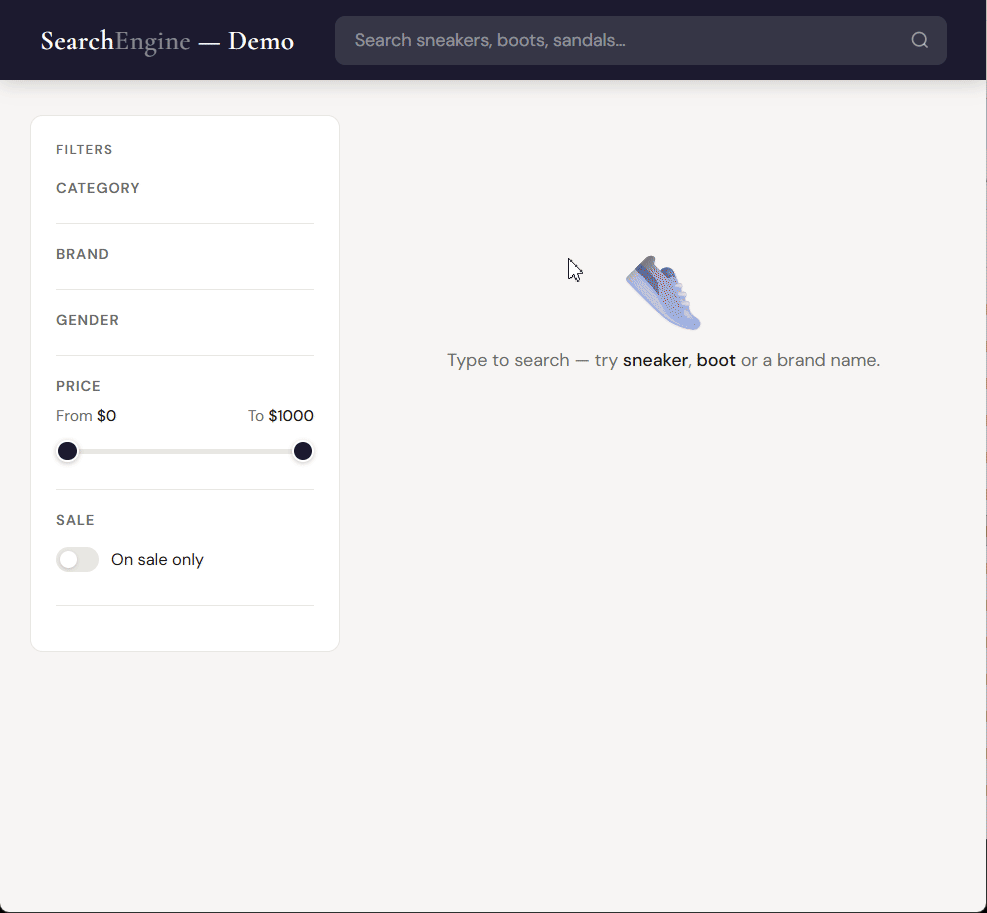

# php-fts


A self-contained full-text search engine written in pure PHP.  
No extensions. No external services. No dependencies. Just files.

```php
$engine = SearchEngine::open('./search_data');

$engine->search('lether shoe');   // finds "leather shoe", one edit away
$engine->search('革靴');           // and finds it in Japanese too
```

---

## Who is this for?

php-fts is for projects where running a dedicated search service is not an
option — shared hosting, a small VPS, or simply a stack you would rather keep
portable and boring.

If you have Elasticsearch, Meilisearch or Typesense and the infrastructure to
run them, **use those**. They are more powerful and built for scale this is not
built for.

If you don't — or would rather not — php-fts gives you ranked full-text search,
typo tolerance, filters, facets and sorting, with nothing to install and nothing
to configure beyond a directory path.

**A good fit if:**
- You are on shared hosting (OVH, Infomaniak, o2switch, …)
- You want zero infrastructure and zero moving parts
- Your dataset runs from hundreds to a few tens of thousands of documents
- You index offline or on a schedule, and serve searches at request time

**Not a good fit if:**
- You need real-time indexing under heavy concurrent writes
- Your dataset is in the millions of documents
- You need geo search or multi-tenant isolation

---

## What you get

- **Typo tolerance you can reason about** — a query word matches an indexed word
  within an edit budget (nothing under three characters, one edit up to five,
  two beyond: the same rule as Elasticsearch's `fuzziness: AUTO`). Edits are
  counted in **characters, not bytes**, so one mistyped Cyrillic or Arabic
  letter costs one edit, not two.
- **Prefix completion** — `leath` finds `leatherman`, `inox` finds `inoxydable`.
- **BM25F ranking** — per-field term frequencies and per-field length
  normalisation, with a boost per field.
- **Filters** — equality, comparisons, ranges, sets, presence, and `and` / `or` /
  `not` nested as deep as you like.
- **Facets** — counts and statistics computed over the whole match set, not over
  the page, and without reading a single document.
- **Sorting and pagination** — by relevance or by any numeric field, with a real
  total.
- **Highlighting** — HTML-escaped by default, with excerpts.
- **Twenty-six writing systems** — see below.
- **Crash-safe writes** — an index is a set of immutable segments published by
  an atomic commit; an interrupted write leaves debris, never damage.
- **No extensions required** — plain PHP 8.1+. `ext-posix` is used if present,
  to spot locks left by a dead process, and the library works without it.

---

## Requirements

- PHP **8.1** or higher
- Read/write access to a directory for the index

---

## Installation

**With Composer**

```bash
composer require ols/php-fts
```

**Without Composer** — copy `src/` into your project and require the bundled
autoloader:

```php
require '/path/to/php-fts/src/autoload.php';
```

---

## Quick start

```php
use Ols\PhpFts\SearchEngine;

$engine = SearchEngine::open('./search_data');

// The array key is the document id. Anything else in the array is a field.
$engine->putMany([
    'p1' => [
        'title'       => 'Brown leather shoe',
        'description' => 'Elegant city shoe in soft leather.',
        'brand'       => 'Adidas',
        'category'    => 'Shoes',
        'price'       => 129.90,
        'stock'       => 42,
        'active'      => true,
        'tags'        => ['city', 'leather'],
    ],
    'p2' => [
        'title'       => 'Black leather boot',
        'description' => 'Winter boot, full grain leather.',
        'brand'       => 'Adidas',
        'category'    => 'Boots',
        'price'       => 189.00,
        'stock'       => 7,
        'active'      => true,
        'tags'        => ['winter', 'leather'],
    ],
    // …
]);

$result = $engine->search('leather shoe', limit: 20);

echo "$result->total matches in {$result->took} ms\n";

foreach ($result as $hit) {
    echo "{$hit->id}  {$hit->score}  {$hit->document['title']}\n";
}
```

```
3 matches in 4.07 ms
p1  1.1985  Brown leather shoe
p5  0.9139  Leather care kit
p2  0.8293  Black leather boot
```

There is no `close()`. A request opens the directory, reads what it needs, and
ends — which is also why it costs about 9 ms on shared hosting to open a
45 000-document index.

---

## Languages and writing systems

Most pure-PHP search libraries are ASCII with an accent-stripping table bolted
on. This one classifies every code point it indexes from Unicode's own data, and
the tables are **generated** by a committed script rather than written by hand.

**Twenty-six writing systems are indexed.** The split below is not cosmetic — it
decides whether a word gets typo tolerance:

**Eighteen that separate their words** — indexed as words, and reachable by the
edit budget and by prefix completion:

> Latin · Cyrillic · Greek · Arabic · Hebrew · Devanagari · Bengali · Gurmukhi ·
> Gujarati · Oriya · Tamil · Telugu · Kannada · Malayalam · Sinhala · Armenian ·
> Georgian · Ethiopic

**Eight written continuously** — indexed as n-grams of a run, because finding
word boundaries there needs a segmentation dictionary this library does not
ship. They are never expanded: an n-gram one edit away is a different word, not
a misspelling.

> Han · Hiragana · Katakana · Hangul · Thai · Lao · Khmer · Myanmar

```php
$engine->putMany([
    'ja' => ['title' => '革靴 ブラウン',       'description' => '柔らかい革の街歩き用の靴。'],
    'ru' => ['title' => 'Кожаные ботинки',     'description' => 'Зимние ботинки из натуральной кожи.'],
    'ar' => ['title' => 'حذاء جلدي بني',       'description' => 'حذاء جلدي ناعم للمدينة.'],
    'th' => ['title' => 'รองเท้าหนังสีน้ำตาล', 'description' => 'รองเท้าหนังนุ่มสำหรับเดินในเมือง'],
]);

$engine->search('革靴');     // finds ja
$engine->search('ботинки');  // finds ru
$engine->search('ботинок');  // a different form of it — also finds ru
$engine->search('جلدي');     // finds ar
$engine->search('รองเท้า');  // finds th
```

A few consequences worth knowing up front. Arabic harakat, Hebrew niqqud and the
tatweel are dropped, so `كِتَاب`, `كــتاب` and `كتاب` are one term. Digits fold
across systems: `٢٠٢٤` and `2024` are the same term, and so are `۱۲۳`, `१२३` and
`123`. Case folding is done from Unicode's mappings, so Vietnamese `VIỆT` meets
`việt` — which a hand-written table got wrong for 916 code points.

Anything outside the twenty-six is treated as a separator: a language written in
it finds **nothing** rather than finding it badly. See [Limits](#limits).

---

## Usage

### Documents

```php
$engine->put('p1', ['title' => 'Brown leather shoe', 'price' => 129.90]);
$id = $engine->insert(['title' => 'Suede boot']);   // generates an id, returns it

$engine->putMany($documents);   // one commit for the whole batch
$engine->get('p1');             // the document, or null
$engine->has('p1');             // bool
$engine->delete('p1');          // bool
$engine->count();               // live documents
$engine->clear();               // wipe the index
```

`putMany()` takes anything iterable and holds **one segment's worth** of data
rather than the whole input, so an import is bounded in memory whatever its
size. Yield straight out of a cursor:

```php
$engine->putMany((function () use ($pdo) {
    foreach ($pdo->query('SELECT * FROM products') as $row) {
        yield $row['sku'] => $row;
    }
})());
```

The whole 45 000-product reference catalogue imports in one call at **64 MB
peak** against a 128 MB limit. The batch is transactional: it lands whole or
leaves the index exactly as it was.

### What a search returns

```php
$result = $engine->search('leather shoe', limit: 20, offset: 0);

$result->total;     // matches across the whole index, not the page size
$result->took;      // milliseconds
$result->hits;      // Hit[]
$result->facets;    // see below
$result->unknown;   // typed words the index holds nothing resembling
$result->isEmpty();

foreach ($result as $hit) {
    $hit->id;
    $hit->score;
    $hit->document;     // the stored document
    $hit->highlights;   // field => marked text, when highlighting was asked for
}
```

`$result->unknown` is what lets you answer the way every search engine answers:

```php
$result = $engine->search('leather zwilling');

$result->unknown;   // ['zwilling']
$result->total;     // 3 — the results for 'leather'
```

Unknown words have to be dropped: keeping one would put its weight in the
threshold with no way to ever satisfy it, so a single stray keystroke would
empty the result instead of narrowing it. Dropping them *silently* is how
`couteau zwilling` quietly becomes `couteau`. Now you can say so.

### Filters

```php
use Ols\PhpFts\Filter;

$result = $engine->search('', filters: Filter::all(
    Filter::eq('active', true),
    Filter::gt('stock', 0),
    Filter::between('price', 50, 200),   // either end may be null
    Filter::any(
        Filter::eq('brand', 'Adidas'),
        Filter::eq('brand', 'Puma'),
    ),
));
```

An empty query means *everything*, so the same call doubles as a category page
with no search box.

| Factory | Meaning |
|---|---|
| `eq` `neq` | equal / not equal |
| `gt` `gte` `lt` `lte` | comparisons |
| `between($field, $min, $max)` | range, either end optional |
| `in` `notIn` | value in a set — on a tags field, *holds any of* |
| `exists` `missing` | the field is present / absent |
| `all` `any` `not` | and / or / negation, nested freely |

Two distinctions that surprise people once:

```php
Filter::neq('brand', 'Nike');             // has a brand, and it is not Nike
Filter::not(Filter::eq('brand', 'Nike')); // is not a Nike — including no brand at all
```

`neq` follows SQL, where a comparison against a missing value is not true. `not`
is plain set complement. Both are useful, so both exist. On a catalogue of three
products where one has no brand at all, the first returns one document and the
second returns two.

Filtering needs a column, so a field must be **in the schema** to be filtered,
faceted or sorted on — including by `exists` and `missing`. A field the schema
does not know is stored and returned, but never filtered, and asking throws
rather than quietly matching nothing.

Filters also accept an array, validated as a structure before any of it reaches
the code that reads files — so `Filter::fromArray()` is safe to point at request
input:

```php
Filter::fromArray(['op' => 'and', 'filters' => [
    ['op' => '=', 'field' => 'active', 'value' => true],
    ['op' => '>', 'field' => 'stock',  'value' => 0],
]]);
```

A malformed filter throws `FilterException` rather than silently matching
nothing. Comparisons are strict: `'42'` does not match `42`. Cast request input
before you build a filter.

### Facets

```php
use Ols\PhpFts\Facet;

$result = $engine->search('', filters: Filter::all(
    Filter::eq('active', true),
    Filter::in('brand', ['Adidas'])->tag('brand'),
), facets: [
    'brand'    => Facet::terms(exclude: 'brand'),
    'category' => Facet::terms(),
    'price'    => Facet::stats(),
]);
```

```php
$result->total;   // 2

$result->facets;
// [
//   'brand'    => ['Adidas' => 2, 'Puma' => 2],
//   'category' => ['Boots' => 1, 'Shoes' => 1],
//   'price'    => ['count' => 2, 'min' => 129.9, 'max' => 189.0,
//                  'sum' => 318.9, 'avg' => 159.45],
// ]
```

Look closely at that output, because it is the whole point of `tag` and
`exclude`. The search is filtered to Adidas, so `total` is 2 and the **category**
facet counts only those two. But the **brand** facet still reports `Puma => 2`,
because it excludes its own clause — which is what makes a multi-select brand
list stay usable after the shopper has clicked Adidas. Without it, picking a
brand makes every other brand vanish and the filter becomes a one-way door.

`Facet::stats()` is the same idea for a slider: excluding `price` gives you the
real bounds of the catalogue rather than of the range already chosen.

Counting happens over bitsets and columns, so **no document is read** to compute
a facet.

### Sorting and pagination

```php
use Ols\PhpFts\Sort;

$engine->search('', sort: Sort::asc('price'));
$engine->search('', sort: [Sort::desc('stock'), Sort::asc('price')]);
$engine->search('shoe');   // relevance, the default

$page2 = $engine->search('shoe', limit: 20, offset: 20);
```

Sorting is the engine's job rather than yours, because it is the same problem as
pagination: twenty hits sorted by price are the twenty best-*scoring* documents
arranged by price, not the twenty cheapest matches.

### Highlighting

```php
use Ols\PhpFts\Highlight;

$result = $engine->search('leather', highlight: Highlight::fields(['title', 'description']));

$result->hits[0]->highlights;
// ['title'       => 'Brown <mark>leather</mark> shoe',
//  'description' => 'Elegant city shoe in soft <mark>leather</mark>.']
```

```php
Highlight::fields(['description'])->tags('<b>', '</b>')->excerpt(3);
// ['description' => '…grain <b>leather</b>.']
```

Field text is **HTML-escaped before the tags are inserted**, so the result is
safe to render even when the indexed content came from users. `->raw()` turns
that off; only use it if you escape downstream.

If you would rather render the marks yourself, `->positions()` hands you the
plain text and the spans instead:

```php
Highlight::fields(['title'])->positions();
// ['title' => ['text' => 'Black leather boot', 'spans' => [[6, 13]]]]
```

### Schema

You do not need one. Types are inferred from the first batch you commit:

```php
$engine = SearchEngine::open('./search_data');   // schema inferred
```

A string field becomes an exact `keyword` — searchable, filterable **and**
facetable — when its values are short (≤ 64 bytes) and it has few distinct ones;
otherwise it stays `text`, searchable only. So on a real catalogue you get this,
which is what you would have declared anyway:

```
title         text
description   text
brand         keyword
category      keyword
price         number
```

Declare one when you want boosts, or want to stop storing a field:

```php
use Ols\PhpFts\Schema;

$schema = Schema::make()
    ->text('title', boost: 3.0)
    ->text('description')
    ->keyword('brand')
    ->tags('tags')
    ->number('price')
    ->number('stock')
    ->boolean('active');

$engine = SearchEngine::open('./search_data', $schema);
```

Per-query boosts work too, and override the schema's:

```php
$engine->search('leather shoe', boosts: ['title' => 3.0, 'description' => 1.0]);
```

One thing to know about the inferred case: a field that first appears **after**
the first commit is refused loudly rather than silently ignored. Declare a schema
if your documents are not all the same shape.

### Maintenance

```php
$engine->stats();
// ['documents' => 4, 'deleted' => 1, 'segments' => 1, 'generation' => 2,
//  'bytes' => 6238, 'fields' => [...], 'needsOptimize' => true, 'schema' => [...]]

if ($engine->stats()['needsOptimize']) {
    $engine->optimize();   // merge segments, drop deleted documents
}
```

Writes are merged on their own as you go; `optimize()` is the manual version,
for a cron job after a big import. Deletes are logical until a merge removes
them, which is why `deleted` and `needsOptimize` exist.

### Errors

Everything thrown descends from `Ols\PhpFts\Exception\FtsException`, so one
`catch` covers the library:

```php
use Ols\PhpFts\Exception\FtsException;

try {
    $result = $engine->search($query, filters: Filter::fromArray($input));
} catch (FtsException $e) {
    // FilterException, SortException, HighlightException, StorageException,
    // CorruptSegmentException, LockException, FieldTypeException, …
}
```

---

## Performance

The number that matters is a **cold** one: nothing survives between requests on
shared hosting, so every visitor pays for opening the index as well as for the
search. These figures include both.

Measured on an **OVH mutualisé** (`cluster105`, PHP 8.3), 45 000 products, 100
fresh interpreters, on `acier lame longueur` — three words each present in about
46% of the catalogue, which is the hardest shape this design has:

| step | p50 | p95 | min | max |
|---|---|---|---|---|
| `open()` the index | 8.7 ms | 13.3 | 7.7 | 21.8 |
| one search | 118.6 ms | 156.0 | 110.8 | 179.6 |
| **both** | **127.4 ms** | **165.7** | 118.5 | 201.4 |

So the typical request lands inside a 150 ms budget and the tail runs about 10%
over it, on the worst query. A one- or two-word search — what most people
actually type — is a fraction of that. Both halves of the pair are given here
rather than the flattering one.

`open()` costs **8.7 ms**, which is *faster* than on the development machine: an
index that is only files, with no daemon to reach and no connection to open,
opens as quickly on a shared host as anywhere.

For the shape of it across queries, cold, on a development machine at the same
45 000 products:

| query | matches | cold total |
|---|---|---|
| `steel` | 1 412 | 23 ms |
| `stel` (a typo) | 1 379 | 25 ms |
| `steel cold` | 746 | 29 ms |
| `couteau de cuisine inox` | 1 013 | 61 ms |
| `couteau` (38% of the catalogue) | 18 750 | 70 ms |
| `acier lame longueur` | 20 109 | 109 ms |

At 45 000 products the index is about **70 MB** on disk and imports in one call
at 64 MB of memory. The full method, and every figure that was wrong before it
was right, is in the [CHANGELOG](CHANGELOG.md).

---

## Limits

Stated plainly, because finding out later is worse:

- **Ranking is tuned against French.** The analyzer is proven over every script,
  and recall and precision are asserted end to end in Latin, Cyrillic, Japanese
  and Thai. What has been judged in one language is **order** — whether the best
  result comes first. That needs a native reader, not another test.
- **Outside the twenty-six systems, nothing is indexed.** Tibetan, Mongolian and
  Cherokee find nothing rather than finding it badly.
- **A word inside a longer word is not found.** `shoe` does not match
  `snowshoes`. Deliberate: the alternative returns *Victorinox* for `inox`.
- **Languages that inflect by prefix are not bridged.** Arabic and Hebrew attach
  the definite article at the front, so `مطبخ` is a suffix of `المطبخ` and
  neither the edit budget nor prefix completion reaches it.
- **Korean gets no typo tolerance.** Hangul is treated as continuous, like
  Lucene's `CJKBigramFilter` does by default. Bigrams handle its agglutination
  well, but Korean does put spaces between words, so this one is a trade rather
  than a necessity.
- **One writer at a time.** Writes take a directory lock. Reads never block.
- **Not for millions of documents**, and not for real-time indexing under
  concurrent writes.

---

## Upgrading from 1.x

**Reindex from your own source data.** There is no migration path and there
cannot be one: a 1.x index stores the character trigrams of documents, and this
one stores words. Opening a version-1 index raises `UnsupportedFormatException`
— deliberately outside the corruption hierarchy, so the rollback machinery
cannot mistake an old index for a torn commit and quietly present it as empty.

The API changed with it: `SearchEngine::open()` is static and there is no
`close()`; `insertBulk()` is `putMany()`; results are `Hit` objects rather than
arrays; filters are built with `Filter` rather than nested arrays; and
`compact()` is `optimize()`.

---

## Index files

```
search_data/
  seg_59b50f835f95.fts   — an immutable segment: terms, postings, columns, documents
  commit.26              — the manifest naming the segments that are live
```

A commit is one atomic rename of a manifest, so a reader sees either the old set
of segments or the new one, never a mixture. A segment nobody's manifest names is
invisible, which is what makes an interrupted write debris rather than damage.

Files are portable — copy the directory between servers, no rebuild.

> **Keep this directory outside your web root.** Documents are stored in it in
> readable form; served over HTTP, your whole index is downloadable. See
> [SECURITY.md](SECURITY.md).

---

## Security

- **Put the index directory outside the web root.** The library cannot enforce it.
- **Never build filters straight from request input.** Cast and whitelist first.
  Strict comparisons stop type confusion; they cannot know which fields a given
  user is allowed to filter on.
- **Highlights are HTML-escaped by default.** Only disable it if you escape later.
- Index files are opened without following symbolic links, and the open
  descriptor is checked against the path, so a link pre-placed in a shared
  directory cannot redirect a write.

Reporting a vulnerability: see [SECURITY.md](SECURITY.md).

---

## Example application

The gif below shows one use of php-fts — a product search with facets, filters
and ranked results, over a fake shoe catalogue. It is an illustration: php-fts is
an engine, not an interface. Use it for a product search, a documentation
search, an admin filter, a CLI tool, or anything else that needs full-text
matching over a set of documents.

To run it locally:

```bash
php demo/seed.php
php -S localhost:8000 -t demo
```



> No database. No external service. The filters, facet counts, scores and totals
> on that page are all computed by the engine, in one call per search.

---

## License

MIT — see [LICENSE](LICENSE).
